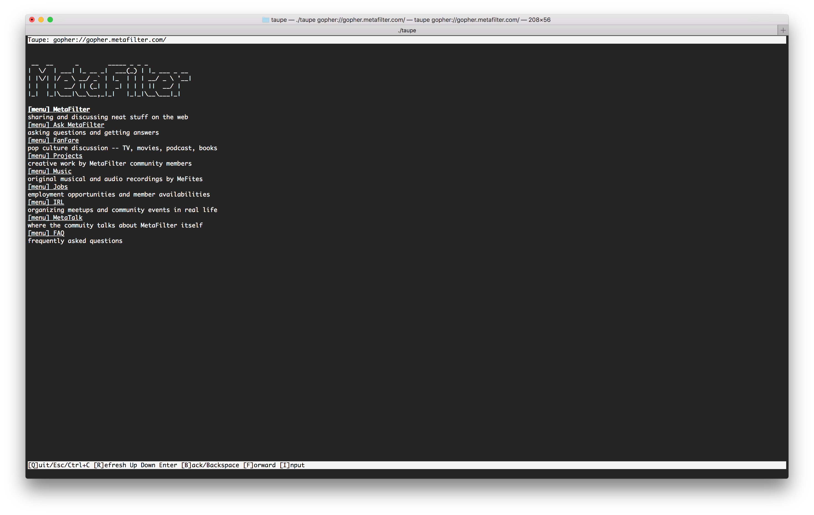
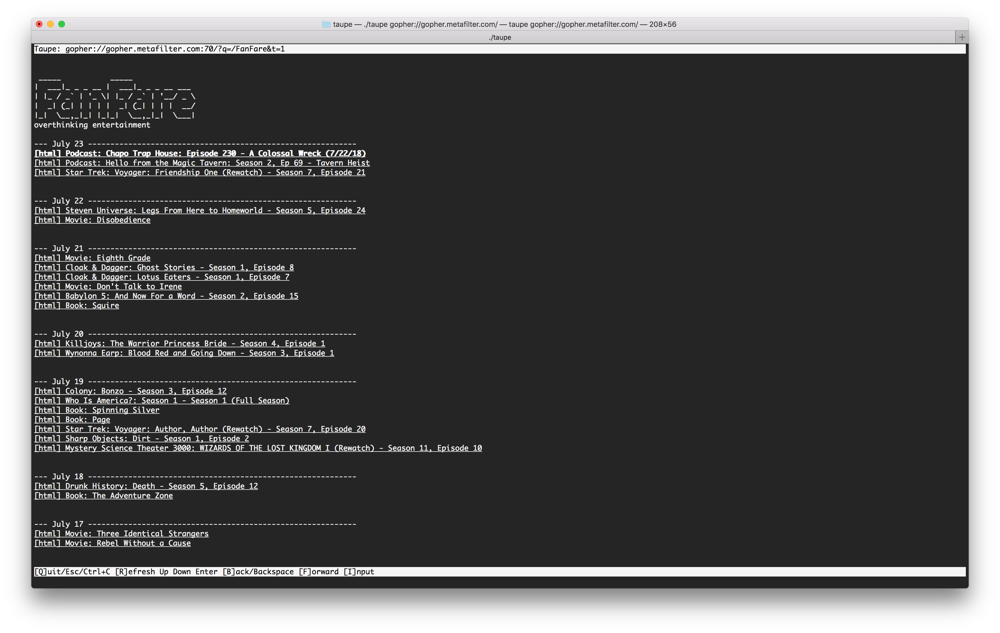

# taupe [](https://travis-ci.org/LouisBrunner/taupe) [](https://coveralls.io/github/LouisBrunner/taupe?branch=master) [](https://goreportcard.com/report/github.com/LouisBrunner/taupe) [](https://godoc.org/github.com/LouisBrunner/taupe)
Simple gopher client (in Go)

# Install it

```
go get -u github.com/LouisBrunner/taupe
```

# Usage

Run the program with the server you want to visit, example:

```
taupe gopher://gopher.metafilter.com/
```

## Screenshots




